# flotopic.com システム地図

> このファイルは `lambda/` 配下を変更する PR で同時更新が必須。`last_verified` が 30 日超えたら `session_bootstrap.sh` が WARN を出す。

## 1. システム概要

flotopic.com は RSS フィードからニュースを自動収集・AI 要約して公開するニュース集約サービス。バックエンドは AWS Lambda + DynamoDB + S3 のサーバーレス構成。フロントエンドは S3 + CloudFront で配信する静的 HTML/JS。ユーザー認証・コメント機能は実装済みだが現在フロントエンドから積極露出していない。

---

## 2. Lambda 一覧

| 関数名 | 責務 (1行) | トリガー | 主な出力先 |
|---|---|---|---|
| **fetcher** | RSS フィードを 30 分ごとに取得しトピックをクラスタリング・DDB に保存 | EventBridge rate(30 min) | DDB: p003-topics / S3: api/snap_* / 即時 processor invoke |
| **processor** | バッチ AI 処理。Claude Haiku でタイトル・要約・予想を生成し静的ファイルを出力 | EventBridge cron JST 05:30/17:30 + judge_prediction 専用 JST 22:00 + fetcher からの直接 invoke | S3: api/topics.json / api/topic/*.json / topics/*.html / api/ogp/*.png / sitemap / RSS |
| **api** | トピック一覧・詳細を DDB から取得して JSON で返す（S3 静的ファイルのフォールバック兼用） | API Gateway GET /topics, /topic/{id} | レスポンス JSON |
| **tracker** | トピックのページビューをカウント（匿名フィンガープリント + VIEW# レコード） | API Gateway POST /track | DDB: p003-topics (VIEW# レコード) |
| **auth** | Google ID トークンを検証してユーザーを作成・取得・プロフィール更新 | API Gateway POST /auth | DDB: flotopic-users |
| **comments** | コメント投稿・一覧・いいね・@mention 通知（Google 認証必須） | API Gateway GET/POST/PUT /comments/*, /notifications/*, /user/*/comments | DDB: ai-company-comments / flotopic-notifications / flotopic-rate-limits |
| **analytics** | 直近 24h ビュー・お気に入りでトレンド集計。S3 キャッシュ更新 | API Gateway GET /analytics/trending, /analytics/user/{userId}, POST /analytics/event | S3: api/analytics.json / DDB: flotopic-analytics |
| **favorites** | お気に入り・閲覧履歴・ジャンル設定の CRUD（Google 認証必須） | API Gateway GET/POST/DELETE /favorites, /history, /prefs, /user | DDB: flotopic-favorites |
| **lifecycle** | 週次でトピックステータスを管理（active→cooling→archived→legacy/DELETE） | EventBridge cron 毎週月曜 JST 11:00 | DDB: p003-topics (status フィールド更新) |
| **cf-analytics** | Cloudflare Web Analytics GraphQL から PV 取得・サイト統計を集計 | EventBridge cron 毎日 JST 07:00 | S3: api/cf-analytics.json |
| **bluesky** | Bluesky にトピックを自動投稿（daily / morning モード） | EventBridge rate(30 min) + cron JST 08:00 (morning) | Bluesky API |
| **contact** | お問い合わせ受信・SES メール通知・管理者用 CRUD | API Gateway POST/GET/POST /contact, /contacts | DDB: flotopic-contacts / flotopic-rate-limits / SES |

---

## 3. データフロー図

```mermaid
flowchart TD
    subgraph Scheduler["EventBridge (スケジューラー)"]
        EB_FETCH["rate(30 min)"]
        EB_PROC["cron JST 05:30/17:30"]
        EB_JUDGE["cron JST 22:00\n(judge_prediction)"]
        EB_LIFE["cron 毎週月曜 JST 11:00"]
        EB_CF["cron 毎日 JST 07:00"]
        EB_BLUE["rate(30 min)\n+ cron JST 08:00"]
    end

    subgraph Lambda
        FETCHER["fetcher\n(RSS収集・クラスタ)"]
        PROCESSOR["processor\n(AI要約・静的生成)"]
        LIFECYCLE["lifecycle\n(ステータス管理)"]
        CF_ANALYTICS["cf-analytics\n(PV集計)"]
        BLUESKY["bluesky\n(SNS投稿)"]
        API["api\n(REST読み取り)"]
        TRACKER["tracker\n(PVカウント)"]
        AUTH["auth\n(Google認証)"]
        COMMENTS["comments\n(コメント管理)"]
        ANALYTICS["analytics\n(ユーザー行動集計)"]
        FAVORITES["favorites\n(お気に入り管理)"]
        CONTACT["contact\n(問い合わせ管理)"]
    end

    subgraph DDB["DynamoDB"]
        DDB_TOPICS["p003-topics\n(メインデータ)"]
        DDB_USERS["flotopic-users"]
        DDB_COMMENTS["ai-company-comments\nflatopic-notifications"]
        DDB_ANALYTICS["flotopic-analytics"]
        DDB_FAVORITES["flotopic-favorites"]
        DDB_CONTACTS["flotopic-contacts"]
        DDB_RL["flotopic-rate-limits"]
    end

    subgraph S3["S3: p003-news-946554699567"]
        S3_TOPICS["api/topics.json\napi/topics-card.json\napi/topic/*.json"]
        S3_STATIC["topics/*.html (静的HTML)"]
        S3_OGP["api/ogp/*.png"]
        S3_ANALYTICS["api/analytics.json\napi/cf-analytics.json"]
        S3_SITEMAP["sitemap.xml / rss.xml"]
    end

    subgraph CloudFront
        CF["CloudFront\n(flotopic.com)"]
    end

    subgraph APIGW["API Gateway"]
        GW["https://x73mzc0v06\n.execute-api.ap-northeast-1"]
    end

    subgraph External
        RSS["RSS フィード\n(外部ニュースサイト)"]
        CLAUDE_API["Anthropic API\n(Claude Haiku)"]
        BLUESKY_API["Bluesky API"]
        CF_API["Cloudflare\nAnalytics API"]
        GOOGLE_API["Google OAuth\n(tokeninfo)"]
        SES["AWS SES\n(メール通知)"]
        SLACK["Slack Webhook\n(エラー通知)"]
    end

    EB_FETCH --> FETCHER
    EB_PROC --> PROCESSOR
    EB_JUDGE --> PROCESSOR
    EB_LIFE --> LIFECYCLE
    EB_CF --> CF_ANALYTICS
    EB_BLUE --> BLUESKY

    RSS --> FETCHER
    FETCHER --> DDB_TOPICS
    FETCHER -->|"新規トピック時\n直接 invoke"| PROCESSOR
    FETCHER --> SLACK

    PROCESSOR --> CLAUDE_API
    PROCESSOR --> DDB_TOPICS
    PROCESSOR --> S3_TOPICS
    PROCESSOR --> S3_STATIC
    PROCESSOR --> S3_OGP
    PROCESSOR --> S3_SITEMAP
    PROCESSOR --> SLACK

    LIFECYCLE --> DDB_TOPICS
    CF_ANALYTICS --> CF_API
    CF_ANALYTICS --> S3_ANALYTICS
    BLUESKY --> BLUESKY_API
    BLUESKY --> DDB_TOPICS

    DDB_TOPICS --> API
    S3_TOPICS --> CF

    GAPIGW["API Gateway"] --> API
    GAPIGW --> TRACKER
    GAPIGW --> AUTH
    GAPIGW --> COMMENTS
    GAPIGW --> ANALYTICS
    GAPIGW --> FAVORITES
    GAPIGW --> CONTACT

    TRACKER --> DDB_TOPICS
    AUTH --> GOOGLE_API
    AUTH --> DDB_USERS
    COMMENTS --> DDB_COMMENTS
    COMMENTS --> DDB_RL
    ANALYTICS --> DDB_ANALYTICS
    ANALYTICS --> S3_ANALYTICS
    FAVORITES --> DDB_FAVORITES
    CONTACT --> DDB_CONTACTS
    CONTACT --> DDB_RL
    CONTACT --> SES

    S3_TOPICS --> CF
    S3_STATIC --> CF
    S3_OGP --> CF
    S3_ANALYTICS --> CF
    S3_SITEMAP --> CF

    CF --> Browser["ブラウザ"]
    GW --> Browser
```

---

## 4. フロントエンド → API マッピング

| ページ | 主な API 呼び出し | ログイン必須 |
|---|---|---|
| index.html | S3 `api/topics-card.json` (初期表示) → `api/topics.json` (詳細) | 不要 |
| topic.html | S3 `api/topic/{tid}.json` → API GW `/topic/{tid}` (フォールバック) | 不要 |
| detail.js | S3 `api/topic/{tid}.json` + API GW `/topic/{tid}` | 不要 |
| app.js | S3 topics-card / topics + API GW `/analytics/active`, `/analytics/event` | 不要 (event 記録のみ) |
| catchup.html | S3 `api/topics.json` + FAVORITES_URL (お気に入り取得) | 任意 |
| storymap.html | S3 `api/topics.json`, `api/topic/{tid}.json` | 不要 |
| mypage.html | AUTH_URL `/auth`, FAVORITES_URL (全 CRUD), ANALYTICS_URL | 必須 |
| profile.html | S3 `api/topics.json` + API GW `/user/{handle}/comments` | 不要 |
| admin.html | AUTH_URL `/auth` + cf-analytics S3 + COMMENTS_URL (管理) | 必須 (管理者) |
| contact.html | CONTACT_URL `/contact` | 不要 |

**S3 静的ファイルは CloudFront 経由で `https://flotopic.com/api/` として公開。**  
**API Gateway は `https://x73mzc0v06.execute-api.ap-northeast-1.amazonaws.com` を直接参照。**

---

## 5. 削除・無効化候補

### コメント機能（現在フロントエンドから積極露出なし）

| 対象 | 場所 | 依存テーブル |
|---|---|---|
| comments Lambda | `lambda/comments/handler.py` | ai-company-comments, flotopic-notifications, flotopic-rate-limits |
| admin.html のコメント管理 UI | `frontend/admin.html` | — |
| detail.js のコメント表示 | `frontend/detail.js` | — |

### ユーザー認証・パーソナライズ機能（フロントエンド露出限定的）

| 対象 | 場所 | 依存テーブル |
|---|---|---|
| auth Lambda | `lambda/auth/handler.py` | flotopic-users |
| favorites Lambda | `lambda/favorites/handler.py` | flotopic-favorites |
| analytics Lambda（ユーザー行動系） | `lambda/analytics/handler.py` | flotopic-analytics |
| mypage.html | `frontend/mypage.html` | — |
| profile.html | `frontend/profile.html` | — |

### 注意

- コメント・お気に入り機能は Lambda・DDB テーブル・フロントエンドが三層で絡む。削除する場合は依存確認が必要。
- `flotopic-rate-limits` テーブルは comments と contact の両方が参照するため、comments だけ消しても残す必要がある。

---

## 6. 設定値散在の課題

### ハードコードされた主な値

| 値 | 場所 | 種別 | リスク |
|---|---|---|---|
| API Gateway URL `x73mzc0v06...` | `frontend/config.js:3` | 直書き | GW 再作成時に漏れる |
| Google OAuth Client ID `632899056251-...` | `frontend/config.js:12` | 直書き | 公開リポジトリにある |
| S3 バケット名 `p003-news-946554699567` | Lambda 4 箇所 (`analytics`, `cf-analytics`, `comments`, `proc_config`) の environ.get デフォルト値 | フォールバック直書き | 環境変数未設定時に意図しないバケットを使う |
| リージョン `ap-northeast-1` | Lambda 12 箇所 (environ.get なし含む) | 直書き | マルチリージョン展開不可。`contact/handler.py` は environ.get なしで直書き |
| Cloudflare サイトタグ `577678a8a00...` | `lambda/cf-analytics/handler.py:26` | environ.get デフォルト | 環境変数未設定時に本番タグが使われる |

### サマリ

- **合計 18 箇所以上**にハードコードまたは environ.get フォールバックとして固定値が散在。
- 環境変数が設定されていれば問題ないが、**新環境構築時に未設定のまま本番値で動く**リスクがある。
- 最優先で対処すべきは `config.js` の API GW URL（URL変更で全フロントエンドが壊れる）と region 直書き（`contact/handler.py` は environ.get すら使っていない）。
